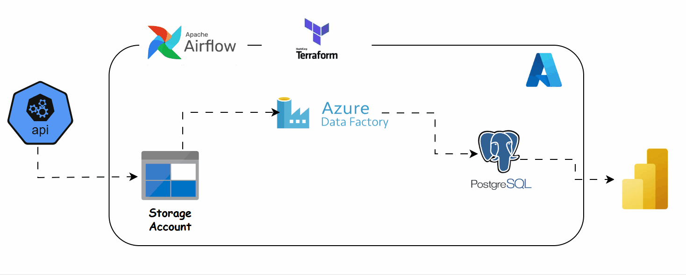

# urban-city-service-request

CivicPulse is a public sector data engineering and analytics initiative designed to transform New York City's 311 service request data into actionable operational intelligence.

The goal is to identify the most common service requests across neighborhoods, uncover emerging community needs, act upon them, enabling city agencies to make faster, data-driven decisions.

 

